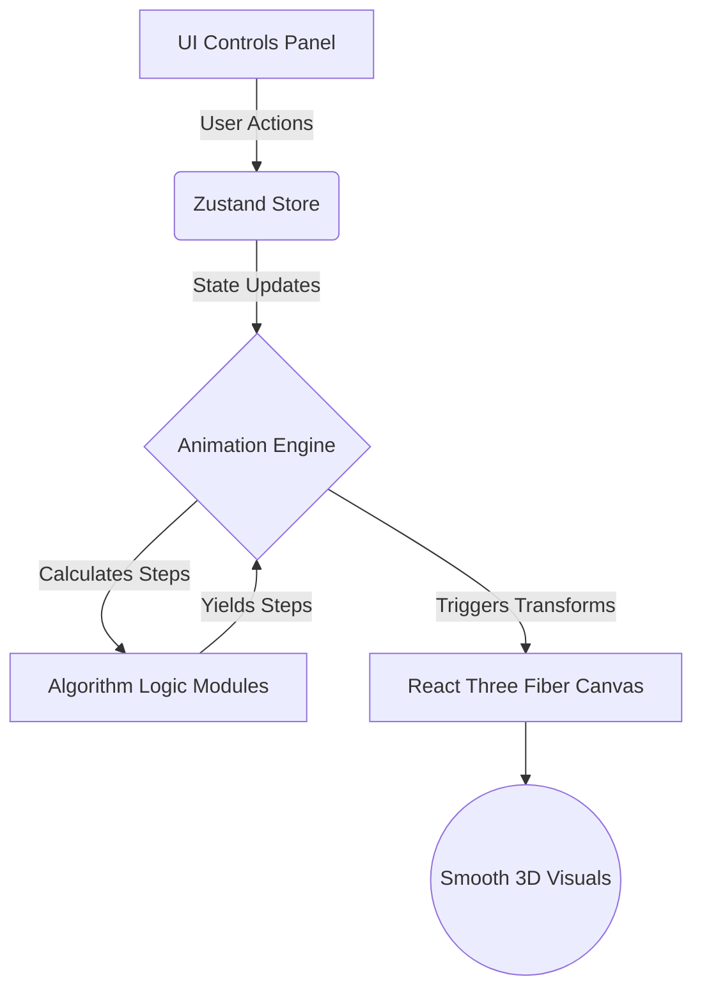

<div align="center">
  
  <h1>🌌 AlgoVerse 🌌</h1>
  <p><strong>An immersive, interactive 3D Data Structures & Algorithms Simulation Lab</strong></p>

  <p>
    
    
    
    
    
  </p>
</div>

---

## 📖 Overview

AlgoVerse brings abstract algorithms and data structures to life. By leveraging the power of **React Three Fiber** and **Framer Motion**, it delivers smooth, high-performance 3D animations wrapped in a stunning, futuristic dark glassmorphism UI.

Whether you're exploring the depths of a Binary Search Tree or watching the mechanics of Quick Sort in real-time, AlgoVerse makes learning intuitive and visually breathtaking.

---

## ✨ Key Features

| Feature | Description |
| :--- | :--- |
| 🎲 **Interactive 3D Visualizations** | Watch algorithms execute step-by-step in a 3D environment with spatial controls. |
| 📊 **Sorting Lab** | Real-time tracking of array states for Merge Sort, Quick Sort, Heap Sort, and more. |
| 🗺️ **Pathfindings** | Visualize complex grid/network pathfinders like Dijkstra's, A*, DFS, and BFS. |
| 🌳 **Data Structures** | Detailed, manipulatable 3D node representations of Trees, Graphs, and Heaps. |
| ⏪ **Playback Engine** | Play, pause, step forward, step backward, and adjust simulation speeds intuitively. |
| 🎨 **Futuristic UI** | A dark-mode first design utilizing smooth glassmorphic elements and micro-interactions. |

---

## 🏗️ Architecture

AlgoVerse is built on a robust, decoupled architecture that separates the simulation state from the 3D rendering engine.



---

## 🚀 Getting Started

Follow these steps to explore AlgoVerse locally:

### Prerequisites
- Node.js (v18.17+)
- npm / yarn / pnpm

### Installation

1. **Clone the repository:**
   ```bash
   git clone https://github.com/yourusername/algoverse.git
   cd algoverse
   ```

2. **Install dependencies:**
   ```bash
   npm install
   ```

3. **Start the development server:**
   ```bash
   npm run dev
   ```

4. Open [http://localhost:3000](http://localhost:3000) and enter the AlgoVerse.

---

## 📂 Project Structure

```text
src/
├── algorithms/      # Core mathematical/logical algorithms (Pathfinding, Sorting)
├── components/      
│   ├── panels/      # Informational 2D overlay panels (InfoPanel, PathInfoPanel)
│   ├── theory/      # Educational modules and deep dives into complexity
│   ├── ui/          # Reusable 2D UI elements (Navbars, Buttons, Sliders)
│   └── visualization/ # React Three Fiber 3D canvases and node objects
├── engine/          # The AnimationEngine coordinating algorithms and Zustand
├── hooks/           # Custom React hooks (useAlgorithmSimulation)
└── store/           # Zustand global execution and UI state
```

---

## 🤝 Contributing

We love contributions! If you have suggestions for new visualizations or better performance enhancements:

1. Fork the Project.
2. Create your Feature Branch: `git checkout -b feature/EpicVisualization`.
3. Commit your Changes: `git commit -m 'Add some EpicVisualization'`.
4. Push to the Branch: `git push origin feature/EpicVisualization`.
5. Open a Pull Request.

---

## 📜 License

Distributed under the **MIT License**. See `LICENSE` for more information.

<div align="center">
  <sub>Built with ❤️ by the AlgoVerse Team</sub>
</div>
